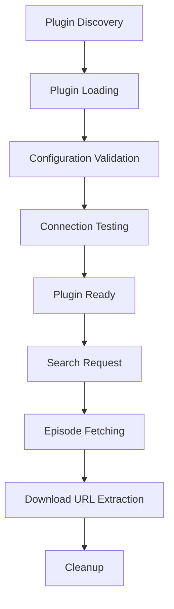

# 🔌 AniPlux Plugin Development Guide

Welcome to the AniPlux Plugin Development Guide! This comprehensive guide will help you create custom source plugins to extend AniPlux's capabilities with new anime streaming sources.

## 📋 Table of Contents

- [🚀 Getting Started](#-getting-started)
- [🏗️ Plugin Architecture](#️-plugin-architecture)
- [📝 Creating Your First Plugin](#-creating-your-first-plugin)
- [🔧 Core Components](#-core-components)
- [🌐 API Integration](#-api-integration)
- [📊 Data Models](#-data-models)
- [🎨 UI Integration](#-ui-integration)
- [🧪 Testing Your Plugin](#-testing-your-plugin)
- [📦 Plugin Distribution](#-plugin-distribution)
- [🛠️ Advanced Features](#️-advanced-features)
- [❓ Troubleshooting](#-troubleshooting)

---

## 🚀 Getting Started

### Prerequisites

Before developing plugins, ensure you have:
- Python 3.8+ installed
- AniPlux development environment set up
- Basic understanding of async/await programming
- Familiarity with web scraping concepts
- Knowledge of the target anime source's structure

### Development Environment Setup

```bash
# Clone AniPlux repository
git clone https://github.com/Yui007/AniPlux.git
cd AniPlux

# Install in development mode
pip install -e ".[dev]"

# Verify installation
aniplux --version
```

### Plugin Development Workflow

1. **Research** - Study the target anime source
2. **Design** - Plan your plugin architecture
3. **Implement** - Write the plugin code
4. **Test** - Thoroughly test all functionality
5. **Document** - Create comprehensive documentation
6. **Submit** - Share with the community

---

## 🏗️ Plugin Architecture

### Core Plugin Structure

```
your_plugin/
├── __init__.py           # Plugin exports
├── plugin.py             # Main plugin class
├── api.py                # API client implementation
├── parser.py             # Data parsing logic
├── config.py             # Configuration management
├── downloader.py         # Download management
├── README.md             # Plugin documentation
└── tests/                # Plugin tests
    ├── __init__.py
    ├── test_plugin.py
    ├── test_api.py
    └── test_parser.py
```

### Plugin Lifecycle



---

## 📝 Creating Your First Plugin

### Step 1: Create Plugin Directory

```bash
# Create plugin directory
mkdir aniplux/plugins/mysite
cd aniplux/plugins/mysite

# Create required files
touch __init__.py plugin.py api.py parser.py config.py
```

### Step 2: Define Plugin Metadata

Create `plugin.py` with basic structure:

```python
"""
MySource Plugin - Custom anime source implementation
"""

import logging
from typing import Dict, List, Optional, Any

from aniplux.plugins.base import BasePlugin, PluginMetadata
from aniplux.core.models import AnimeResult, Episode, Quality
from aniplux.core.exceptions import PluginError, NetworkError

from .api import MySiteAPI
from .parser import MySiteParser
from .config import MySiteConfig, get_default_config

logger = logging.getLogger(__name__)

# Plugin metadata
plugin_metadata = PluginMetadata(
    name="MySource",
    version="1.0.0",
    author="Your Name",
    description="Custom anime source plugin for mysite.com",
    website="https://mysite.com",
    supported_qualities=[Quality.LOW, Quality.MEDIUM, Quality.HIGH],
    rate_limit=1.0,  # Seconds between requests
    requires_auth=False
)

class MySitePlugin(BasePlugin):
    """Custom plugin for MySource anime streaming site."""
    
    def __init__(self, config: Optional[Dict[str, Any]] = None):
        """Initialize plugin with configuration."""
        super().__init__(config or get_default_config())
        
        # Initialize components
        self.api = MySiteAPI(self.session)
        self.parser = MySiteParser()
        
        logger.debug("MySource plugin initialized")
    
    @property
    def metadata(self) -> PluginMetadata:
        """Get plugin metadata."""
        return plugin_metadata
    
    async def search(self, query: str) -> List[AnimeResult]:
        """Search for anime on MySource."""
        # Implementation here
        pass
    
    async def get_episodes(self, anime_url: str) -> List[Episode]:
        """Get episodes for specific anime."""
        # Implementation here
        pass
    
    async def get_download_url(self, episode_url: str, quality: Quality) -> str:
        """Get direct download URL for episode."""
        # Implementation here
        pass
    
    async def validate_connection(self) -> bool:
        """Test connection to MySource."""
        # Implementation here
        pass
```

### Step 3: Implement Configuration

Create `config.py`:

```python
"""
MySource Plugin Configuration
"""

from typing import Dict, Any, List
from pydantic import BaseModel, Field, HttpUrl

from aniplux.core.models import Quality

class MySiteConfig(BaseModel):
    """Configuration model for MySource plugin."""
    
    # Basic settings
    enabled: bool = Field(True, description="Enable/disable plugin")
    base_url: str = Field("https://mysite.com", description="Base URL")
    api_base_url: str = Field("https://api.mysite.com", description="API base URL")
    
    # Search settings
    search_limit: int = Field(50, ge=1, le=100, description="Max search results")
    quality_preference: str = Field("1080p", description="Preferred quality")
    
    # Rate limiting
    request_delay: float = Field(1.0, ge=0.1, description="Delay between requests")
    max_retries: int = Field(3, ge=1, description="Max retry attempts")
    
    # Optional authentication
    username: str = Field("", description="Username (if required)")
    password: str = Field("", description="Password (if required)")

def get_default_config() -> Dict[str, Any]:
    """Get default configuration for MySource plugin."""
    return MySiteConfig().model_dump()

def merge_with_defaults(user_config: Dict[str, Any]) -> Dict[str, Any]:
    """Merge user configuration with defaults."""
    default_config = get_default_config()
    if user_config:
        default_config.update(user_config)
    return default_config

# Quality mapping
QUALITY_MAP = {
    "480p": Quality.LOW,
    "720p": Quality.MEDIUM,
    "1080p": Quality.HIGH,
}
```

### Step 4: Implement API Client

Create `api.py`:

```python
"""
MySource API Client
"""

import logging
import asyncio
from typing import Dict, List, Optional, Any
import aiohttp

from aniplux.core.exceptions import PluginError, NetworkError

logger = logging.getLogger(__name__)

class MySiteAPI:
    """API client for MySource."""
    
    def __init__(self, session: aiohttp.ClientSession, base_url: str = "https://api.mysite.com"):
        """Initialize API client."""
        self.session = session
        self.base_url = base_url
        
        # Default headers
        self.headers = {
            "User-Agent": "Mozilla/5.0 (Windows NT 10.0; Win64; x64) AppleWebKit/537.36",
            "Accept": "application/json",
            "Referer": "https://mysite.com/"
        }
    
    async def search_anime(self, query: str, page: int = 1, limit: int = 20) -> List[Dict[str, Any]]:
        """Search for anime."""
        try:
            params = {
                "q": query,
                "page": page,
                "limit": limit,
                "type": "anime"
            }
            
            url = f"{self.base_url}/search"
            
            async with self.session.get(url, headers=self.headers, params=params, timeout=15) as response:
                if response.status != 200:
                    raise NetworkError(f"Search failed with status {response.status}")
                
                data = await response.json()
                return data.get("results", [])
                
        except aiohttp.ClientError as e:
            raise NetworkError(f"Network error during search: {e}")
        except Exception as e:
            raise PluginError(f"Search failed: {e}")
    
    async def get_anime_info(self, anime_id: str) -> Dict[str, Any]:
        """Get detailed anime information."""
        try:
            url = f"{self.base_url}/anime/{anime_id}"
            
            async with self.session.get(url, headers=self.headers, timeout=15) as response:
                if response.status != 200:
                    raise NetworkError(f"Info request failed with status {response.status}")
                
                return await response.json()
                
        except aiohttp.ClientError as e:
            raise NetworkError(f"Network error getting anime info: {e}")
        except Exception as e:
            raise PluginError(f"Failed to get anime info: {e}")
    
    async def get_episodes(self, anime_id: str) -> List[Dict[str, Any]]:
        """Get episodes for anime."""
        try:
            url = f"{self.base_url}/anime/{anime_id}/episodes"
            
            async with self.session.get(url, headers=self.headers, timeout=15) as response:
                if response.status != 200:
                    raise NetworkError(f"Episodes request failed with status {response.status}")
                
                data = await response.json()
                return data.get("episodes", [])
                
        except aiohttp.ClientError as e:
            raise NetworkError(f"Network error getting episodes: {e}")
        except Exception as e:
            raise PluginError(f"Failed to get episodes: {e}")
    
    async def get_stream_url(self, episode_id: str, quality: str = "1080p") -> Optional[str]:
        """Get streaming URL for episode."""
        try:
            url = f"{self.base_url}/episode/{episode_id}/stream"
            params = {"quality": quality}
            
            async with self.session.get(url, headers=self.headers, params=params, timeout=15) as response:
                if response.status != 200:
                    return None
                
                data = await response.json()
                return data.get("stream_url")
                
        except Exception as e:
            logger.error(f"Failed to get stream URL: {e}")
            return None
```

### Step 5: Implement Data Parser

Create `parser.py`:

```python
"""
MySource Data Parser
"""

import logging
import re
from typing import Dict, List, Optional, Any
from urllib.parse import urljoin

logger = logging.getLogger(__name__)

class MySiteParser:
    """Parser for MySource API responses."""
    
    def __init__(self, base_url: str = "https://mysite.com"):
        """Initialize parser."""
        self.base_url = base_url
    
    def parse_search_results(self, search_data: List[Dict[str, Any]]) -> List[Dict[str, Any]]:
        """Parse search results from API."""
        parsed_results = []
        
        for anime in search_data:
            try:
                # Extract basic information
                anime_id = str(anime.get("id", ""))
                title = anime.get("title", "Unknown Title")
                
                # Construct URLs
                anime_url = f"{self.base_url}/anime/{anime_id}"
                
                # Extract metadata
                description = anime.get("description", "")
                if len(description) > 200:
                    description = description[:200] + "..."
                
                episode_count = anime.get("episode_count")
                year = anime.get("year")
                genres = anime.get("genres", [])
                rating = anime.get("rating")
                status = anime.get("status", "").title()
                thumbnail = anime.get("thumbnail")
                
                parsed_anime = {
                    "id": anime_id,
                    "title": title,
                    "url": anime_url,
                    "description": description,
                    "thumbnail": thumbnail,
                    "episode_count": episode_count,
                    "year": year,
                    "genres": genres,
                    "rating": rating,
                    "status": status
                }
                
                parsed_results.append(parsed_anime)
                
            except Exception as e:
                logger.warning(f"Failed to parse anime data: {e}")
                continue
        
        return parsed_results
    
    def parse_episodes(self, episodes_data: List[Dict[str, Any]], anime_id: str) -> List[Dict[str, Any]]:
        """Parse episodes data from API."""
        parsed_episodes = []
        
        for episode in episodes_data:
            try:
                # Extract episode information
                episode_id = str(episode.get("id", ""))
                episode_number = episode.get("number")
                title = episode.get("title", f"Episode {episode_number}")
                
                # Skip invalid episodes
                if not episode_number or not title.strip():
                    continue
                
                # Construct episode URL
                episode_url = f"{self.base_url}/watch/{anime_id}/{episode_number}"
                
                # Extract metadata
                duration = episode.get("duration")
                air_date = episode.get("air_date")
                
                parsed_episode = {
                    "id": episode_id,
                    "number": int(episode_number),
                    "title": title.strip(),
                    "url": episode_url,
                    "duration": duration,
                    "air_date": air_date
                }
                
                parsed_episodes.append(parsed_episode)
                
            except Exception as e:
                logger.warning(f"Failed to parse episode data: {e}")
                continue
        
        # Sort by episode number
        parsed_episodes.sort(key=lambda x: x.get("number", 0))
        return parsed_episodes
    
    def extract_anime_id(self, anime_url: str) -> Optional[str]:
        """Extract anime ID from URL."""
        pattern = r'/anime/([^/]+)'
        match = re.search(pattern, anime_url)
        return match.group(1) if match else None
    
    def clean_title(self, title: str) -> str:
        """Clean and normalize title."""
        if not title:
            return ""
        
        # Remove extra whitespace
        title = re.sub(r'\s+', ' ', title.strip())
        
        # Remove common prefixes
        title = re.sub(r'^(anime\s*[:\-]?\s*)', '', title, flags=re.IGNORECASE)
        
        return title.strip()
```

---

## 🔧 Core Components

### BasePlugin Class

All plugins must inherit from `BasePlugin`:

```python
from aniplux.plugins.base import BasePlugin, PluginMetadata

class YourPlugin(BasePlugin):
    """Your custom plugin implementation."""
    
    def __init__(self, config: Optional[Dict[str, Any]] = None):
        super().__init__(config)
        # Your initialization code
    
    @property
    def metadata(self) -> PluginMetadata:
        """Return plugin metadata."""
        return your_plugin_metadata
    
    # Required methods
    async def search(self, query: str) -> List[AnimeResult]: ...
    async def get_episodes(self, anime_url: str) -> List[Episode]: ...
    async def get_download_url(self, episode_url: str, quality: Quality) -> str: ...
    async def validate_connection(self) -> bool: ...
```

### Required Methods

#### `search(query: str) -> List[AnimeResult]`
Search for anime and return results.

```python
async def search(self, query: str) -> List[AnimeResult]:
    """Search for anime."""
    if not query.strip():
        raise PluginError("Search query cannot be empty")
    
    try:
        # Get search results from API
        search_data = await self.api.search_anime(query)
        
        # Parse results
        parsed_results = self.parser.parse_search_results(search_data)
        
        # Convert to AnimeResult objects
        anime_results = []
        for result_data in parsed_results:
            result = create_anime_result(
                title=result_data['title'],
                url=result_data['url'],
                source=self.metadata.name.lower() + "_plugin",
                episode_count=result_data.get('episode_count'),
                description=result_data.get('description'),
                thumbnail=result_data.get('thumbnail'),
                year=result_data.get('year'),
                genres=result_data.get('genres', []),
                rating=result_data.get('rating'),
                status=result_data.get('status')
            )
            anime_results.append(result)
        
        return anime_results
        
    except NetworkError:
        raise
    except Exception as e:
        raise PluginError(f"Search failed: {e}")
```

#### `get_episodes(anime_url: str) -> List[Episode]`
Get episodes for a specific anime.

```python
async def get_episodes(self, anime_url: str) -> List[Episode]:
    """Get episodes for anime."""
    if not anime_url:
        raise PluginError("Anime URL cannot be empty")
    
    try:
        # Extract anime ID from URL
        anime_id = self.parser.extract_anime_id(anime_url)
        if not anime_id:
            raise PluginError("Could not extract anime ID from URL")
        
        # Get episodes data
        episodes_data = await self.api.get_episodes(anime_id)
        
        # Parse episodes
        parsed_episodes = self.parser.parse_episodes(episodes_data, anime_id)
        
        # Convert to Episode objects
        episodes = []
        for ep_data in parsed_episodes:
            episode = create_episode(
                number=ep_data['number'],
                title=ep_data['title'],
                url=ep_data['url'],
                source=self.metadata.name.lower() + "_plugin",
                quality_options=[Quality.LOW, Quality.MEDIUM, Quality.HIGH]
            )
            episodes.append(episode)
        
        return episodes
        
    except NetworkError:
        raise
    except Exception as e:
        raise PluginError(f"Failed to get episodes: {e}")
```

#### `get_download_url(episode_url: str, quality: Quality) -> str`
Get direct download URL for an episode.

```python
async def get_download_url(self, episode_url: str, quality: Quality) -> str:
    """Get download URL for episode."""
    if not episode_url:
        raise PluginError("Episode URL cannot be empty")
    
    try:
        # Extract episode ID
        episode_id = self.parser.extract_episode_id(episode_url)
        if not episode_id:
            raise PluginError("Could not extract episode ID from URL")
        
        # Get stream URL
        quality_str = quality.value
        stream_url = await self.api.get_stream_url(episode_id, quality_str)
        
        if not stream_url:
            raise PluginError("No download URL found")
        
        return stream_url
        
    except NetworkError:
        raise
    except Exception as e:
        raise PluginError(f"Failed to get download URL: {e}")
```

#### `validate_connection() -> bool`
Test connection to the anime source.

```python
async def validate_connection(self) -> bool:
    """Validate connection to source."""
    try:
        # Test with a simple search
        test_results = await self.api.search_anime("test", limit=1)
        return True
    except Exception as e:
        logger.error(f"Connection validation failed: {e}")
        return False
```

---

## 🌐 API Integration

### HTTP Client Best Practices

#### Use Proper Headers
```python
headers = {
    "User-Agent": "Mozilla/5.0 (Windows NT 10.0; Win64; x64) AppleWebKit/537.36",
    "Accept": "application/json, text/html,application/xhtml+xml",
    "Accept-Language": "en-US,en;q=0.9",
    "Accept-Encoding": "gzip, deflate, br",
    "DNT": "1",
    "Connection": "keep-alive",
    "Upgrade-Insecure-Requests": "1",
}
```

#### Handle Rate Limiting
```python
import asyncio

class RateLimitedAPI:
    def __init__(self, rate_limit: float = 1.0):
        self.rate_limit = rate_limit
        self.last_request = 0
    
    async def make_request(self, url: str, **kwargs):
        # Enforce rate limit
        now = asyncio.get_event_loop().time()
        time_since_last = now - self.last_request
        
        if time_since_last < self.rate_limit:
            await asyncio.sleep(self.rate_limit - time_since_last)
        
        # Make request
        async with self.session.get(url, **kwargs) as response:
            self.last_request = asyncio.get_event_loop().time()
            return response
```

#### Error Handling
```python
async def safe_request(self, url: str, **kwargs):
    """Make HTTP request with proper error handling."""
    max_retries = 3
    retry_delay = 1.0
    
    for attempt in range(max_retries):
        try:
            async with self.session.get(url, **kwargs) as response:
                if response.status == 200:
                    return await response.json()
                elif response.status == 429:  # Rate limited
                    await asyncio.sleep(retry_delay * (2 ** attempt))
                    continue
                else:
                    raise NetworkError(f"HTTP {response.status}: {response.reason}")
                    
        except aiohttp.ClientError as e:
            if attempt == max_retries - 1:
                raise NetworkError(f"Network error: {e}")
            await asyncio.sleep(retry_delay)
    
    raise NetworkError("Max retries exceeded")
```

### Web Scraping Guidelines

#### HTML Parsing
```python
from bs4 import BeautifulSoup
from aniplux.plugins.common import HTMLParser

async def scrape_page(self, url: str) -> Dict[str, Any]:
    """Scrape data from HTML page."""
    async with self.session.get(url) as response:
        html = await response.text()
    
    parser = HTMLParser(html, base_url=url)
    
    # Extract data using CSS selectors
    title = parser.find_text("h1.anime-title")
    episodes = parser.find_all_text(".episode-list .episode-title")
    thumbnail = parser.find_attr("img.anime-poster", "src")
    
    return {
        "title": title,
        "episodes": episodes,
        "thumbnail": thumbnail
    }
```

#### JavaScript-Heavy Sites
For sites that require JavaScript execution, use Selenium:

```python
from selenium import webdriver
from selenium.webdriver.common.by import By
from selenium.webdriver.support.ui import WebDriverWait
from selenium.webdriver.support import expected_conditions as EC

class SeleniumScraper:
    def __init__(self):
        options = webdriver.ChromeOptions()
        options.add_argument("--headless")
        options.add_argument("--no-sandbox")
        options.add_argument("--disable-dev-shm-usage")
        self.driver = webdriver.Chrome(options=options)
    
    async def scrape_dynamic_content(self, url: str):
        """Scrape content that requires JavaScript."""
        self.driver.get(url)
        
        # Wait for content to load
        wait = WebDriverWait(self.driver, 10)
        episodes = wait.until(
            EC.presence_of_all_elements_located((By.CLASS_NAME, "episode-item"))
        )
        
        # Extract data
        episode_data = []
        for episode in episodes:
            title = episode.find_element(By.CLASS_NAME, "episode-title").text
            url = episode.find_element(By.TAG_NAME, "a").get_attribute("href")
            episode_data.append({"title": title, "url": url})
        
        return episode_data
    
    def cleanup(self):
        """Clean up Selenium resources."""
        if self.driver:
            self.driver.quit()
```

---

## 📊 Data Models

### Using Pydantic Models

AniPlux uses Pydantic for data validation. Always use the provided helper functions:

```python
from aniplux.plugins.common import create_anime_result, create_episode
from aniplux.core.models import Quality

# Create AnimeResult
anime_result = create_anime_result(
    title="Attack on Titan",
    url="https://mysite.com/anime/attack-on-titan",
    source="mysite_plugin",
    episode_count=87,
    description="Humanity fights against titans...",
    year=2013,
    genres=["Action", "Drama", "Fantasy"],
    rating=9.0,
    status="Completed"
)

# Create Episode
episode = create_episode(
    number=1,
    title="To You, in 2000 Years",
    url="https://mysite.com/watch/attack-on-titan/1",
    source="mysite_plugin",
    quality_options=[Quality.LOW, Quality.MEDIUM, Quality.HIGH],
    duration="24:00"
)
```

### Data Validation

Always validate data before creating models:

```python
def validate_episode_data(self, episode_data: Dict[str, Any]) -> bool:
    """Validate episode data before processing."""
    required_fields = ["number", "title", "url"]
    
    for field in required_fields:
        if not episode_data.get(field):
            logger.warning(f"Missing required field: {field}")
            return False
    
    # Validate episode number
    try:
        episode_number = int(episode_data["number"])
        if episode_number < 1:
            return False
    except (ValueError, TypeError):
        return False
    
    # Validate title
    title = episode_data["title"].strip()
    if not title or len(title) < 1:
        return False
    
    return True
```

---

## 🎨 UI Integration

### Plugin Status Display

Your plugin should provide status information:

```python
def get_status_info(self) -> Dict[str, Any]:
    """Get plugin status information."""
    return {
        "name": self.metadata.name,
        "version": self.metadata.version,
        "enabled": self.config.get("enabled", True),
        "connection_status": "connected" if self.last_connection_test else "unknown",
        "last_search": self.last_search_time,
        "total_searches": self.search_count,
        "success_rate": self.calculate_success_rate()
    }
```

### Progress Reporting

For long-running operations, report progress:

```python
from aniplux.ui import get_console

async def bulk_operation_with_progress(self, items: List[Any]):
    """Perform bulk operation with progress reporting."""
    console = get_console()
    
    with console.status("[bold green]Processing items...") as status:
        for i, item in enumerate(items):
            status.update(f"Processing item {i+1}/{len(items)}: {item.name}")
            await self.process_item(item)
            
            # Update progress
            progress = (i + 1) / len(items) * 100
            console.print(f"Progress: {progress:.1f}%")
```

---

## 🧪 Testing Your Plugin

### Unit Tests

Create comprehensive unit tests:

```python
# tests/test_mysite_plugin.py
import pytest
import asyncio
from unittest.mock import AsyncMock, MagicMock

from aniplux.plugins.mysite.plugin import MySitePlugin
from aniplux.core.models import Quality

class TestMySitePlugin:
    """Test suite for MySource plugin."""
    
    @pytest.fixture
    def plugin(self):
        """Create plugin instance for testing."""
        config = {
            "enabled": True,
            "base_url": "https://mysite.com",
            "search_limit": 10
        }
        return MySitePlugin(config)
    
    @pytest.mark.asyncio
    async def test_search_success(self, plugin):
        """Test successful search operation."""
        # Mock API response
        plugin.api.search_anime = AsyncMock(return_value=[
            {
                "id": "123",
                "title": "Test Anime",
                "episode_count": 12,
                "year": 2023
            }
        ])
        
        # Perform search
        results = await plugin.search("test anime")
        
        # Assertions
        assert len(results) == 1
        assert results[0].title == "Test Anime"
        assert results[0].episode_count == 12
        assert results[0].year == 2023
    
    @pytest.mark.asyncio
    async def test_search_empty_query(self, plugin):
        """Test search with empty query."""
        with pytest.raises(PluginError, match="Search query cannot be empty"):
            await plugin.search("")
    
    @pytest.mark.asyncio
    async def test_get_episodes(self, plugin):
        """Test episode fetching."""
        # Mock API responses
        plugin.api.get_episodes = AsyncMock(return_value=[
            {"id": "ep1", "number": 1, "title": "Episode 1"},
            {"id": "ep2", "number": 2, "title": "Episode 2"}
        ])
        
        # Get episodes
        episodes = await plugin.get_episodes("https://mysite.com/anime/123")
        
        # Assertions
        assert len(episodes) == 2
        assert episodes[0].number == 1
        assert episodes[0].title == "Episode 1"
    
    @pytest.mark.asyncio
    async def test_connection_validation(self, plugin):
        """Test connection validation."""
        # Mock successful connection
        plugin.api.search_anime = AsyncMock(return_value=[])
        
        result = await plugin.validate_connection()
        assert result is True
        
        # Mock failed connection
        plugin.api.search_anime = AsyncMock(side_effect=Exception("Connection failed"))
        
        result = await plugin.validate_connection()
        assert result is False
```

### Integration Tests

Test with real API endpoints (use sparingly):

```python
@pytest.mark.integration
@pytest.mark.asyncio
async def test_real_search(self):
    """Test search with real API (integration test)."""
    plugin = MySitePlugin()
    
    try:
        results = await plugin.search("popular anime")
        assert len(results) > 0
        assert all(result.title for result in results)
    except Exception as e:
        pytest.skip(f"Integration test failed: {e}")
```

### Manual Testing

Create a test script for manual testing:

```python
# test_manual.py
import asyncio
from aniplux.plugins.mysite.plugin import MySitePlugin

async def manual_test():
    """Manual testing script."""
    plugin = MySitePlugin()
    
    print("Testing connection...")
    connected = await plugin.validate_connection()
    print(f"Connection: {'✅' if connected else '❌'}")
    
    if connected:
        print("\nTesting search...")
        results = await plugin.search("demon slayer")
        print(f"Found {len(results)} results")
        
        if results:
            print(f"First result: {results[0].title}")
            
            print("\nTesting episodes...")
            episodes = await plugin.get_episodes(str(results[0].url))
            print(f"Found {len(episodes)} episodes")
            
            if episodes:
                print(f"First episode: {episodes[0].title}")
                
                print("\nTesting download URL...")
                download_url = await plugin.get_download_url(
                    str(episodes[0].url), 
                    Quality.HIGH
                )
                print(f"Download URL: {download_url[:50]}...")
    
    await plugin.cleanup()

if __name__ == "__main__":
    asyncio.run(manual_test())
```

---

## 📦 Plugin Distribution

### Plugin Registration

Register your plugin in `__init__.py`:

```python
# aniplux/plugins/mysite/__init__.py
"""
MySource Plugin for AniPlux
"""

from .plugin import MySitePlugin, plugin_metadata, get_default_config

# Plugin exports
__all__ = ["MySitePlugin", "plugin_metadata", "get_default_config"]

# Plugin information
__plugin_name__ = "mysite_plugin"
__plugin_class__ = MySitePlugin
__plugin_metadata__ = plugin_metadata
__plugin_config__ = get_default_config
```

### Plugin Entry Point

Add entry point in main plugin file:

```python
# aniplux/plugins/mysite_plugin.py
"""
MySource Plugin Entry Point
"""

from .mysite import MySitePlugin, plugin_metadata, get_default_config

# Export for plugin discovery
default_config = get_default_config()
__all__ = ["MySitePlugin", "plugin_metadata", "default_config"]
```

### Documentation

Create comprehensive documentation:

```markdown
# MySource Plugin

## Overview
Custom plugin for MySource anime streaming site.

## Features
- Search anime by title
- Browse episodes with metadata
- Download in multiple qualities
- Rate limiting and error handling

## Configuration
```json
{
  "enabled": true,
  "base_url": "https://mysite.com",
  "search_limit": 50,
  "quality_preference": "1080p"
}
```

## Installation
1. Copy plugin files to `aniplux/plugins/mysite/`
2. Restart AniPlux
3. Enable plugin: `aniplux sources enable mysite_plugin`

## Usage
```bash
# Search using MySource
aniplux search anime "your query" --source mysite_plugin

# Test plugin
aniplux sources test mysite_plugin
```

## Troubleshooting
- Check connection: `aniplux sources test mysite_plugin`
- View logs: `aniplux --verbose search "test"`
- Reset config: `aniplux sources reset mysite_plugin`
```

---

## 🛠️ Advanced Features

### Custom Download Managers

Implement custom download logic:

```python
class CustomDownloadManager:
    """Custom download manager for special cases."""
    
    def __init__(self, api, parser, config):
        self.api = api
        self.parser = parser
        self.config = config
    
    async def extract_download_url(self, episode_url: str, quality: Quality) -> str:
        """Extract download URL with custom logic."""
        # Custom extraction logic here
        pass
    
    async def download_with_external_tool(self, url: str, output_path: str) -> bool:
        """Download using external tool."""
        # Custom download implementation
        pass
```

### Authentication Support

Handle authentication if required:

```python
class AuthenticatedAPI:
    """API client with authentication support."""
    
    def __init__(self, session, username: str = "", password: str = ""):
        self.session = session
        self.username = username
        self.password = password
        self.auth_token = None
    
    async def authenticate(self) -> bool:
        """Authenticate with the service."""
        if not self.username or not self.password:
            return True  # No auth required
        
        try:
            auth_data = {
                "username": self.username,
                "password": self.password
            }
            
            async with self.session.post("/auth/login", json=auth_data) as response:
                if response.status == 200:
                    data = await response.json()
                    self.auth_token = data.get("token")
                    return True
                return False
                
        except Exception as e:
            logger.error(f"Authentication failed: {e}")
            return False
    
    def get_auth_headers(self) -> Dict[str, str]:
        """Get headers with authentication."""
        headers = self.base_headers.copy()
        if self.auth_token:
            headers["Authorization"] = f"Bearer {self.auth_token}"
        return headers
```

### Caching Support

Implement caching for better performance:

```python
import time
from typing import Optional

class CachedAPI:
    """API client with caching support."""
    
    def __init__(self, session, cache_ttl: int = 300):
        self.session = session
        self.cache = {}
        self.cache_ttl = cache_ttl
    
    def _get_cache_key(self, method: str, *args, **kwargs) -> str:
        """Generate cache key."""
        return f"{method}:{hash(str(args) + str(sorted(kwargs.items())))}"
    
    def _is_cache_valid(self, timestamp: float) -> bool:
        """Check if cache entry is still valid."""
        return time.time() - timestamp < self.cache_ttl
    
    async def cached_request(self, method: str, *args, **kwargs):
        """Make cached request."""
        cache_key = self._get_cache_key(method, *args, **kwargs)
        
        # Check cache
        if cache_key in self.cache:
            data, timestamp = self.cache[cache_key]
            if self._is_cache_valid(timestamp):
                logger.debug(f"Cache hit for {method}")
                return data
        
        # Make request
        if method == "search_anime":
            data = await self.search_anime(*args, **kwargs)
        elif method == "get_episodes":
            data = await self.get_episodes(*args, **kwargs)
        else:
            raise ValueError(f"Unknown method: {method}")
        
        # Cache result
        self.cache[cache_key] = (data, time.time())
        return data
```

### Plugin Hooks

Implement hooks for extensibility:

```python
class HookablePlugin(BasePlugin):
    """Plugin with hook support."""
    
    def __init__(self, config):
        super().__init__(config)
        self.hooks = {
            "before_search": [],
            "after_search": [],
            "before_download": [],
            "after_download": []
        }
    
    def add_hook(self, event: str, callback):
        """Add hook callback."""
        if event in self.hooks:
            self.hooks[event].append(callback)
    
    async def run_hooks(self, event: str, *args, **kwargs):
        """Run hooks for event."""
        for callback in self.hooks.get(event, []):
            try:
                await callback(*args, **kwargs)
            except Exception as e:
                logger.error(f"Hook error in {event}: {e}")
    
    async def search(self, query: str) -> List[AnimeResult]:
        """Search with hooks."""
        await self.run_hooks("before_search", query)
        results = await super().search(query)
        await self.run_hooks("after_search", query, results)
        return results
```

---

## ❓ Troubleshooting

### Common Issues

#### 1. Plugin Not Loading
```bash
# Check plugin discovery
aniplux sources list

# Check for errors
aniplux --verbose sources reload

# Verify plugin structure
ls -la aniplux/plugins/your_plugin/
```

#### 2. Search Returning No Results
```python
# Add debug logging
logger.debug(f"API response: {search_data}")
logger.debug(f"Parsed results: {parsed_results}")

# Test API directly
async def debug_search():
    api = YourAPI(session)
    data = await api.search_anime("test")
    print(f"Raw API data: {data}")
```

#### 3. Download URLs Not Working
```python
# Validate URLs
from urllib.parse import urlparse

def validate_url(url: str) -> bool:
    try:
        result = urlparse(url)
        return all([result.scheme, result.netloc])
    except:
        return False

# Test URL accessibility
async def test_download_url(url: str):
    async with aiohttp.ClientSession() as session:
        async with session.head(url) as response:
            print(f"Status: {response.status}")
            print(f"Headers: {dict(response.headers)}")
```

#### 4. Rate Limiting Issues
```python
# Implement exponential backoff
import random

async def retry_with_backoff(func, max_retries=3):
    for attempt in range(max_retries):
        try:
            return await func()
        except Exception as e:
            if attempt == max_retries - 1:
                raise
            
            # Exponential backoff with jitter
            delay = (2 ** attempt) + random.uniform(0, 1)
            await asyncio.sleep(delay)
```

### Debugging Tools

#### Enable Debug Logging
```python
import logging

# Set up debug logging
logging.basicConfig(level=logging.DEBUG)
logger = logging.getLogger(__name__)

# Add debug statements
logger.debug(f"Processing anime: {anime_data}")
logger.debug(f"Extracted ID: {anime_id}")
logger.debug(f"Generated URL: {anime_url}")
```

#### Network Debugging
```python
import aiohttp
import aiohttp_debugtoolbar

# Enable request logging
async def debug_session():
    connector = aiohttp.TCPConnector(limit=10)
    timeout = aiohttp.ClientTimeout(total=30)
    
    session = aiohttp.ClientSession(
        connector=connector,
        timeout=timeout,
        trace_configs=[aiohttp.TraceConfig()]
    )
    
    return session
```

#### Performance Profiling
```python
import time
import functools

def profile_async(func):
    """Decorator to profile async functions."""
    @functools.wraps(func)
    async def wrapper(*args, **kwargs):
        start_time = time.time()
        try:
            result = await func(*args, **kwargs)
            return result
        finally:
            end_time = time.time()
            logger.info(f"{func.__name__} took {end_time - start_time:.2f}s")
    return wrapper

# Usage
@profile_async
async def search(self, query: str):
    # Your search implementation
    pass
```

### Testing Checklist

Before submitting your plugin, ensure:

- [ ] All required methods are implemented
- [ ] Error handling is comprehensive
- [ ] Rate limiting is respected
- [ ] URLs are properly validated
- [ ] Data models are correctly used
- [ ] Unit tests pass
- [ ] Integration tests work
- [ ] Documentation is complete
- [ ] Code follows style guidelines
- [ ] No hardcoded credentials
- [ ] Proper logging is implemented
- [ ] Plugin metadata is accurate

---

## 🎯 Best Practices

### Code Quality
- Use type hints throughout your code
- Follow PEP 8 style guidelines
- Write comprehensive docstrings
- Implement proper error handling
- Use async/await consistently

### Performance
- Implement proper rate limiting
- Use connection pooling
- Cache frequently accessed data
- Minimize API calls
- Handle large datasets efficiently

### Security
- Never hardcode credentials
- Validate all input data
- Use HTTPS for all requests
- Implement proper authentication
- Sanitize user inputs

### Maintainability
- Keep functions small and focused
- Use descriptive variable names
- Separate concerns properly
- Write comprehensive tests
- Document all public APIs

---

## 📚 Resources

### Documentation
- [AniPlux Core Models](aniplux/core/models.py)
- [Base Plugin Class](aniplux/plugins/base.py)
- [Plugin Utilities](aniplux/plugins/common/)
- [Example Plugins](aniplux/plugins/)

### Tools
- [aiohttp Documentation](https://docs.aiohttp.org/)
- [BeautifulSoup Documentation](https://www.crummy.com/software/BeautifulSoup/bs4/doc/)
- [Pydantic Documentation](https://pydantic-docs.helpmanual.io/)
- [pytest Documentation](https://docs.pytest.org/)

### Community
- [GitHub Issues](https://github.com/Yui007/AniPlux/issues)
- [GitHub Discussions](https://github.com/Yui007/AniPlux/discussions)
- [Plugin Examples](https://github.com/Yui007/AniPlux/tree/main/aniplux/plugins)

---

## 🤝 Contributing Your Plugin

### Submission Process
1. **Test thoroughly** - Ensure your plugin works reliably
2. **Document completely** - Provide comprehensive documentation
3. **Follow guidelines** - Adhere to coding standards
4. **Submit PR** - Create a pull request with your plugin
5. **Respond to feedback** - Address review comments promptly

### Plugin Review Criteria
- **Functionality** - Plugin works as intended
- **Code Quality** - Clean, readable, well-structured code
- **Documentation** - Comprehensive docs and examples
- **Testing** - Adequate test coverage
- **Performance** - Efficient and responsive
- **Security** - No security vulnerabilities

---

**Happy plugin development! 🚀**

*Made with ❤️ by the AniPlux community*